# /notion-dev 스킬 흐름도 (Mermaid)

## 전체 실행 흐름

```mermaid
flowchart TD
    Start(["/notion-dev URL 실행"]) --> Step1

    subgraph Step1 ["1단계: Notion 사양서 읽기"]
        A1[Notion MCP 호출] --> A2[페이지 내용 가져오기]
        A2 --> A3[하위 블록 읽기]
        A3 --> A4{하위 페이지 있음?}
        A4 -->|Yes| A3
        A4 -->|No| A5[사양서 파싱 완료]
    end

    Step1 --> Step2

    subgraph Step2 ["2단계: 사양 분석"]
        B1[기능 요구사항 추출] --> B2[데이터 모델 파악]
        B2 --> B3[API 설계 확인]
        B3 --> B4[UI/UX 파악]
    end

    Step2 --> Step3

    subgraph Step3 ["3단계: 개발 범위 선택"]
        C1{어떤 범위로 개발?}
        C1 -->|Frontend| C2[Frontend 선택]
        C1 -->|Backend| C3[Backend 선택]
        C1 -->|Fullstack| C4[Fullstack 선택]
    end

    Step3 --> Step4

    subgraph Step4 ["4단계: 작업 계획"]
        D1[TodoWrite로 작업 목록 생성]
    end

    Step4 --> Step5

    subgraph Step5 ["5단계: 구현"]
        E1{선택된 범위}
        E1 -->|Frontend| FE[Frontend 구현]
        E1 -->|Backend| BE[Backend TDD 구현]
        E1 -->|Fullstack| FS[DB → Backend TDD → Frontend]
    end

    Step5 --> Step6

    subgraph Step6 ["6단계: 검증"]
        F1[pytest 실행] --> F2[타입 체크]
        F2 --> F3[API 연동 확인]
    end

    Step6 --> End([완료])
```

---

## Backend TDD 사이클

```mermaid
flowchart LR
    subgraph TDD ["TDD 사이클 (Red-Green-Refactor)"]
        Red["🔴 Red<br/>실패하는 테스트 작성"]
        Green["🟢 Green<br/>테스트 통과하는<br/>최소 코드 작성"]
        Refactor["🔵 Refactor<br/>코드 정리"]

        Red --> Green --> Refactor --> Red
    end
```

---

## Backend TDD 상세 흐름

```mermaid
flowchart TD
    Start([기능 구현 시작]) --> WriteTest

    subgraph Red ["🔴 Red Phase"]
        WriteTest[tests/test_xxx.py 작성] --> RunTest1[pytest 실행]
        RunTest1 --> Check1{테스트 실패?}
        Check1 -->|No| WriteTest
        Check1 -->|Yes| RedDone[Red 완료]
    end

    RedDone --> Implement

    subgraph Green ["🟢 Green Phase"]
        Implement[main.py에 구현] --> RunTest2[pytest 실행]
        RunTest2 --> Check2{테스트 통과?}
        Check2 -->|No| Implement
        Check2 -->|Yes| GreenDone[Green 완료]
    end

    GreenDone --> Cleanup

    subgraph RefactorPhase ["🔵 Refactor Phase"]
        Cleanup[코드 정리] --> RunTest3[pytest 실행]
        RunTest3 --> Check3{테스트 통과?}
        Check3 -->|No| Cleanup
        Check3 -->|Yes| RefactorDone[Refactor 완료]
    end

    RefactorDone --> MoreFeatures{더 구현할 기능?}
    MoreFeatures -->|Yes| WriteTest
    MoreFeatures -->|No| End([구현 완료])
```

---

## 개발 범위별 작업 흐름

```mermaid
flowchart TD
    subgraph Frontend ["Frontend Only"]
        FE1[컴포넌트 생성] --> FE2[페이지 구현]
        FE2 --> FE3[API 연동]
        FE3 --> FE4[스타일링]
    end

    subgraph Backend ["Backend Only (TDD)"]
        BE1[테이블 생성] --> BE2[테스트 작성]
        BE2 --> BE3[API 구현]
        BE3 --> BE4[리팩토링]
        BE4 --> BE5{다음 API?}
        BE5 -->|Yes| BE2
        BE5 -->|No| BE6[완료]
    end

    subgraph Fullstack ["Fullstack"]
        FS1[Supabase 테이블 생성] --> FS2[Backend TDD]
        FS2 --> FS3[Frontend 구현]
        FS3 --> FS4[통합 테스트]
    end
```

---

## 프로젝트 구조

---

## 시퀀스 다이어그램

```mermaid
sequenceDiagram
    participant User as 사용자
    participant Claude as Claude Code
    participant Notion as Notion MCP
    participant Supabase as Supabase MCP
    participant FS as 파일 시스템

    User->>Claude: /notion-dev [URL]

    rect rgb(200, 220, 250)
        Note over Claude,Notion: 1단계: 사양서 읽기
        Claude->>Notion: 페이지 조회
        Notion-->>Claude: 페이지 내용
        Claude->>Notion: 블록 children 조회
        Notion-->>Claude: 블록 내용
    end

    rect rgb(200, 250, 220)
        Note over Claude: 2단계: 사양 분석
        Claude->>Claude: 요구사항 추출
    end

    rect rgb(250, 220, 200)
        Note over User,Claude: 3단계: 범위 선택
        Claude->>User: Frontend/Backend/Fullstack?
        User-->>Claude: Fullstack
    end

    rect rgb(250, 250, 200)
        Note over Claude: 4단계: 작업 계획
        Claude->>Claude: TodoWrite
    end

    rect rgb(220, 200, 250)
        Note over Claude,FS: 5단계: 구현
        Claude->>Supabase: 테이블 생성
        Supabase-->>Claude: 완료

        loop TDD 사이클
            Claude->>FS: 테스트 작성
            Claude->>FS: pytest 실행
            Claude->>FS: 구현 코드 작성
            Claude->>FS: pytest 실행
        end

        Claude->>FS: Frontend 구현
    end

    rect rgb(200, 250, 250)
        Note over Claude: 6단계: 검증
        Claude->>FS: pytest 실행
        Claude->>Claude: 타입 체크
    end

    Claude->>User: 완료 보고
```

---

## 상태 다이어그램

```mermaid
stateDiagram-v2
    [*] --> 사양서읽기: /notion-dev 실행

    사양서읽기 --> 사양분석: Notion MCP 완료
    사양분석 --> 범위선택: 분석 완료

    범위선택 --> Frontend: Frontend 선택
    범위선택 --> Backend: Backend 선택
    범위선택 --> Fullstack: Fullstack 선택

    state Backend {
        [*] --> Red
        Red --> Green: 테스트 작성
        Green --> Refactor: 구현 완료
        Refactor --> Red: 다음 기능
        Refactor --> [*]: 모든 기능 완료
    }

    state Fullstack {
        [*] --> DB생성
        DB생성 --> BackendTDD
        BackendTDD --> Frontend구현
        Frontend구현 --> [*]
    }

    Frontend --> 검증
    Backend --> 검증
    Fullstack --> 검증

    검증 --> [*]: 완료
```

